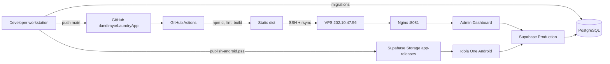

# 1. Arsitektur Deployment dan Environment

## 1. Gambaran sistem

## 2. Environment yang dikenal

| Environment | Komponen | Sumber konfigurasi | Catatan |
| --- | --- | --- | --- |
| Local development | Flutter dan React/Vite | dart-define, environment lokal | Tidak boleh memakai service-role pada client. |
| Preview/test | Mode preview Flutter dan build lokal dashboard | data preview/fake atau project test bila disediakan | Belum ada project Supabase staging yang terdokumentasi. |
| Production | Supabase project `sqydcdhvsmmkvlpsjzgx` | GitHub secrets dan konfigurasi release | Dipakai Android dan dashboard. |
| Production web host | VPS `202.10.47.56` | GitHub Actions secrets | Static dashboard, target `/var/www/apps/dandivps-deploy`. |

## 3. Komponen dan tanggung jawab

### GitHub

- repository: `dandirayo/LaundryApp`;
- branch deploy: `main`;
- menyimpan workflow dan source;
- GitHub Actions menyimpan secret deployment;
- concurrency group mencegah dua publish dashboard berjalan bersamaan.

### VPS

- menerima `dist/` melalui akun deployment terbatas;
- menyimpan staging dan satu backup rilis sebelumnya;
- Nginx menyajikan file statis;
- tidak menyimpan Supabase service-role untuk dashboard browser.

### Supabase

- Auth, database, RLS, Realtime, Storage, dan RPC;
- bucket `app-releases` menyajikan APK/manifest update;
- migration database tidak dijalankan oleh workflow dashboard saat ini.

### Android

- APK ditandatangani dengan certificate yang kompatibel dengan instalasi sebelumnya;
- aplikasi membaca manifest `app-releases/android/latest.json`;
- Android tetap meminta konfirmasi pengguna untuk memasang APK.

## 4. Matriks deploy

| Perubahan | Pipeline yang harus berjalan | Dampak |
| --- | --- | --- |
| Hanya dashboard web | GitHub Actions `Deploy Admin Dashboard` | VPS web saja. |
| Hanya aplikasi Flutter | Analyze, test, build, lalu `publish-android.ps1` | APK/manifest Supabase Storage. |
| Hanya schema/RLS/RPC | Review dan apply migration Supabase | Backend semua client. |
| Dashboard + schema | Apply migration kompatibel lebih dulu, lalu deploy dashboard | Hindari dashboard memanggil kolom/RPC yang belum tersedia. |
| Flutter + schema | Gunakan pola expand/migrate lalu publish APK | Perangkat lama harus tetap berjalan selama masa update. |

## 5. Strategi environment yang disarankan

Tambahkan satu environment staging sebelum sistem berkembang lebih jauh:

- project Supabase staging terpisah;
- GitHub Environment `staging` dan `production`;
- URL staging/domain staging terpisah;
- data uji tanpa data pelanggan produksi;
- promosi migration yang sama dari staging ke production;
- approval production untuk perubahan database dan Android, sedangkan static web dapat tetap otomatis setelah quality gate lulus.

