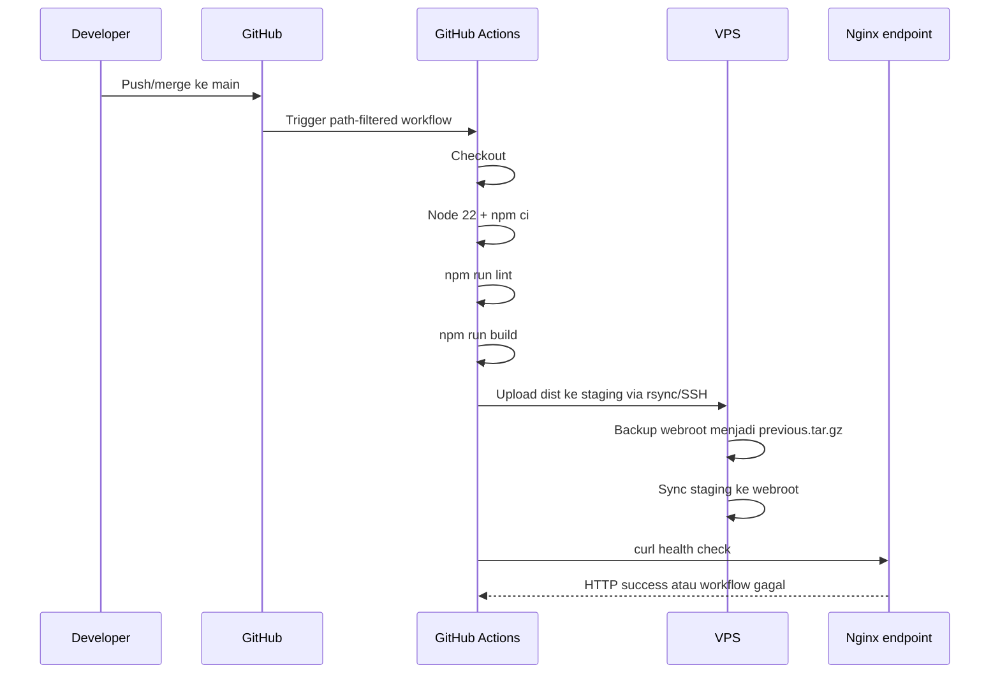

# 2. CI/CD dan Auto Deploy

## 1. Kondisi pipeline saat ini

Workflow `.github/workflows/deploy-admin.yml` aktif dan menjalankan auto deploy dashboard ketika ada push ke `main` yang mengubah:

- `admin_dashboard_web/**`; atau
- `.github/workflows/deploy-admin.yml`.

Workflow juga dapat dijalankan manual melalui `workflow_dispatch`.

## 2. Alur dashboard admin



Konfigurasi yang sudah baik:

- dependency install memakai `npm ci`;
- lint dan build harus lulus sebelum upload;
- SSH host key dipin;
- upload masuk ke staging lebih dulu;
- target path diperiksa secara eksplisit;
- rilis sebelumnya dicadangkan;
- `rsync --delete` menjaga webroot sama dengan artifact;
- post-deploy HTTP verification tersedia;
- deployment serial melalui concurrency group.

## 3. Status GitHub Actions

Pada 20 September 2026:

- workflow **Deploy Admin Dashboard** berstatus aktif;
- enam secret yang dibutuhkan sudah terdaftar;
- empat deployment terakhir yang terlihat pada 6 September 2026 berhasil setelah satu run gagal;
- run sukses terbaru: [GitHub Actions run 34026106625](https://github.com/dandirayo/LaundryApp/actions/runs/34026106625).

Nilai secret tidak dibaca atau ditulis ke dokumen.

## 4. Android release

Android belum auto deploy dari GitHub Actions. Rilis dijalankan secara terkontrol dari workstation:

```powershell
./scripts/publish-android.ps1 -ReleaseNotes 'Ringkasan perubahan untuk pengguna.'
```

Script melakukan:

1. mengambil konfigurasi project Supabase yang terhubung;
2. membuat APK universal dan per ABI;
3. memeriksa application ID, version/build, dan certificate;
4. mengunggah APK ke path immutable berbasis hash;
5. mengunduh ulang untuk memeriksa SHA-256;
6. mempublikasikan `latest.json` paling akhir;
7. menghasilkan bootstrap APK lokal.

Ini merupakan **continuous delivery dengan publish manual**, karena instalasi tetap membutuhkan persetujuan Android dan continuity signing key harus dijaga.

## 5. Database migration

Database juga belum auto deploy. Urutan aman:

1. buat migration baru;
2. review schema, grant, RLS, index, dan backward compatibility;
3. terapkan ke staging;
4. jalankan smoke test owner/karyawan;
5. backup produksi;
6. apply ke production;
7. verifikasi schema dan fungsi;
8. baru deploy client yang memerlukan schema baru.

Migration produksi sebaiknya tetap memerlukan approval manual walaupun pemeriksaan SQL nanti diotomatisasi.

## 6. Target pipeline yang disarankan

### Pull request checks

- Flutter analyze dan test bila file aplikasi berubah;
- dashboard lint dan build bila file web berubah;
- validasi migration dan policy bila SQL berubah;
- secret scanning dan dependency audit;
- tidak melakukan deployment.

### Merge ke main

- dashboard: auto deploy ke production setelah checks lulus;
- migration: menunggu approval GitHub Environment;
- Android: build artifact otomatis, publish manifest menunggu approval.

### Post-deploy

- cek endpoint dan asset utama;
- login smoke test non-destruktif;
- simpan metadata commit SHA, waktu, dan hasil health check;
- kirim notifikasi hanya ketika gagal atau selesai dengan perubahan bermakna.

## 7. Perbaikan pipeline yang direkomendasikan

| Prioritas | Perbaikan | Alasan |
| --- | --- | --- |
| P0 | Perbaiki akses endpoint `202.10.47.56:8081` | Semua port web timeout saat pemeriksaan 20 September 2026. |
| P0 | Tambah `environment: production` pada job | Mendukung approval, audit, dan scoped secrets. |
| P0 | Tambah timeout per step/job | Mencegah run menggantung saat SSH/VPS tidak merespons. |
| P1 | Simpan artifact `dist` di GitHub Actions | Memudahkan audit dan redeploy artifact yang sama. |
| P1 | Backup dengan timestamp dan retensi | Satu `previous.tar.gz` tidak cukup untuk beberapa kegagalan beruntun. |
| P1 | Health endpoint/domain HTTPS | Lebih representatif daripada raw IP HTTP. |
| P1 | Auto rollback bila health check gagal | Mengurangi waktu pemulihan. |
| P2 | Staging deployment | Menangkap error sebelum production. |
| P2 | Build APK di CI dengan publish approval | Build reproducible tanpa memindahkan signing secara sembarang. |

