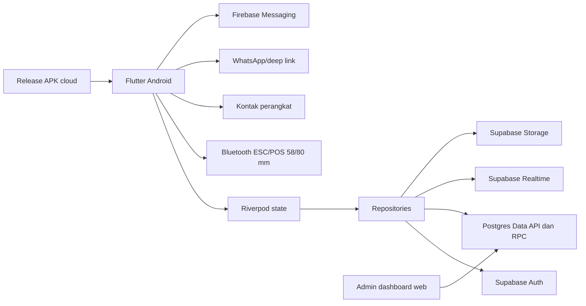

# 2. Technical Requirements Document

**Acuan:** Idola One 2.1.2+18, schema produksi 20 September 2026

## 1. Arsitektur



Aplikasi memakai pendekatan feature-first. Setiap fitur memisahkan model domain, repository data, controller Riverpod, dan halaman/widget presentasi. `GoRouter` mengatur route dan redirect berbasis sesi serta peran.

## 2. Stack saat ini

| Lapisan | Teknologi |
| --- | --- |
| Client | Flutter, Dart SDK `^3.12.2` |
| State | `flutter_riverpod ^3.3.2` |
| Routing | `go_router ^17.3.0` |
| Backend | Supabase Auth, PostgreSQL, Data API/RPC, Realtime, Storage |
| Local persistence | `flutter_secure_storage`, `shared_preferences`, Drift |
| Notification | Firebase Core dan Firebase Messaging |
| Device integration | `flutter_contacts`, `image_picker`, `url_launcher` |
| Printing | `print_bluetooth_thermal ^1.2.4`, ESC/POS bytes |
| Serialization/test | Freezed, json_serializable, mocktail, Flutter integration test |
| UI | Material 3, DM Sans, tema navy/biru/emas |

## 3. Struktur aplikasi

```text
laundry_app_flutter/lib/
├── app/                 # bootstrap dan shell navigasi
├── core/
│   ├── router/          # route, guard, dan history kembali
│   ├── services/        # Supabase, push, Bluetooth/receipt
│   ├── theme/           # token warna dan ThemeData
│   └── widgets/         # komponen lintas fitur
├── features/
│   ├── auth, businesses, pos
│   ├── orders, customers, services
│   ├── inventory, expenses, cashbook, reports
│   ├── employees, shifts, attendance, payroll
│   ├── employee_requests, notifications
│   └── printer, backup, settings, app_updates
└── shared/              # katalog awal dan data preview
```

Kontrak tiap fitur:

- **Domain** tidak bergantung pada widget.
- **Repository** menangani mapping data, RPC, query, dan error backend.
- **Controller/provider** menyimpan state layar dan memicu refresh.
- **Presentation** menangani input, feedback, dan navigasi.

## 4. Konteks sesi dan akses

1. Supabase Auth memulihkan sesi.
2. `profiles` menentukan `shop_id`, `role`, dan status akun.
3. Daftar `businesses` diperoleh dari kepemilikan owner atau `business_members` aktif.
4. Pengguna memilih usaha dan aplikasi menyimpan active business.
5. Shell navigasi dipilih berdasarkan `business.kind` dan peran.
6. `AppRoutes.canOpen` menahan route yang salah peran.
7. RLS tetap menjadi lapisan otorisasi utama.

Route guard bukan pengganti RLS. Seluruh 30 tabel publik pada schema produksi saat ini memiliki RLS aktif.

## 5. Kontrak backend penting

| Operasi | Mekanisme | Jaminan |
| --- | --- | --- |
| Buat laundry order | `public.create_laundry_order(...)` | Header, item, total, pembayaran awal, dan nomor order diproses dalam transaksi database. |
| Tambah pembayaran | `public.record_order_payment(...)` | Validasi jumlah, payment row, dan sinkronisasi status/arus kas. |
| Ubah stok | `public.adjust_inventory_stock(...)` | Mutasi dan saldo stok diperbarui bersama. |
| Checkout POS | `public.create_pos_sale(...)` | Sale dan semua item dibuat atomik menggunakan snapshot produk. |
| Poin pelanggan | trigger `app_private.sync_customer_points()` | Satu event per order; balance mengikuti order yang lunas. |
| Sinkron kas | trigger functions | Payment, expense, payroll, dan employee request tertentu membentuk cash transaction. |
| Audit | `public.write_audit_log()` | Perubahan entitas penting dicatat dengan actor dan data lama/baru. |

## 6. Realtime dan refresh

Realtime dipakai untuk data yang perlu terlihat lintas perangkat, seperti pesanan, notifikasi, pengajuan, dan saldo poin. Setiap subscription wajib:

- difilter menggunakan `shop_id`, `business_id`, profil, atau referensi relevan;
- dibatalkan saat provider/widget dihentikan;
- memiliki fallback refresh manual;
- tidak mengasumsikan urutan event sebagai sumber kebenaran tunggal.

Query awal dari repository tetap menjadi snapshot sumber kebenaran; event realtime memicu update atau refresh setelahnya.

## 7. Printer thermal

Lapisan printer terdiri dari:

- penyimpanan printer Bluetooth yang dipilih;
- pemeriksaan izin dan koneksi Android;
- builder ESC/POS untuk lebar 58 dan 80 mm;
- pencetakan logo dengan pemangkasan ruang kosong;
- builder terpisah untuk nota, label cucian, dan bukti pengambilan;
- test print pada halaman pengaturan printer.

Transaksi disimpan sebelum proses cetak. Kegagalan Bluetooth ditampilkan sebagai kegagalan cetak dan dokumen dapat dicetak ulang dari detail pesanan.

## 8. Navigasi

`GoRouter` mengelola route deklaratif. `AppNavigationHistory` dan `AppBackGuard` menjaga urutan halaman sehingga back kembali ke asal yang nyata. Shell memiliki konfigurasi tab berbeda:

- Owner laundry: Beranda, Pesanan, Pelanggan, Lainnya.
- Karyawan laundry: Beranda dengan aksi cepat Pelanggan, Pesanan Saya, Absensi, Lainnya.
- POS minuman: Ringkasan, Kasir, Produk, Lainnya.

Deep link atau route tanpa history memakai parent yang sesuai konteks sebagai fallback.

## 9. Keamanan

- Client hanya memakai publishable/anon key Supabase; secret/service-role tidak boleh masuk APK.
- Tabel Data API memakai RLS dan grant minimum.
- Akses laundry dibatasi melalui `current_shop_id()`, `current_role()`, atau relasi profil.
- Akses POS dibatasi melalui helper schema privat `can_access_business()` dan `is_business_owner()`.
- Fungsi `SECURITY DEFINER` harus memiliki `search_path` eksplisit dan izin execute terbatas.
- Foto absensi disimpan dalam bucket dengan kebijakan folder/anggota toko.
- PIN tidak boleh dipakai sebagai pengganti sesi Auth untuk akses database.

Acuan teknis resmi: [Securing your data](https://supabase.com/docs/guides/database/secure-data), [Securing your API](https://supabase.com/docs/guides/api/securing-your-api), dan [Row Level Security](https://supabase.com/docs/guides/database/postgres/row-level-security).

## 10. Data lokal dan kondisi jaringan

- Secure storage menyimpan data yang perlu dilindungi seperti preferensi sesi/perangkat.
- Shared preferences menyimpan pilihan non-sensitif seperti printer dan konteks UI.
- Drift tersedia sebagai fondasi cache lokal, tetapi rilis saat ini belum menjamin antrean transaksi offline penuh.
- Saat jaringan gagal, UI harus mempertahankan input yang belum dikirim bila aman dan menawarkan retry.
- Aplikasi tidak boleh mengklaim transaksi berhasil sebelum RPC backend mengembalikan hasil.

## 11. Konfigurasi dan deployment

- URL dan key Supabase diberikan melalui konfigurasi build/env, bukan di source control.
- Android release memakai version name/build number dari `pubspec.yaml`.
- APK update dipublikasikan ke storage/release endpoint dan diperiksa aplikasi.
- Migrasi baru harus ditambah sebagai file timestamp di `supabase/migrations`, diterapkan ke project target, lalu diverifikasi terhadap schema produksi.
- Admin dashboard memiliki deployment terpisah; aksesnya tetap tunduk pada Auth/RLS atau backend terpercaya.

## 12. Pengujian

Minimum quality gate:

```text
flutter analyze
flutter test
flutter build apk --release
```

Selain unit/widget test, rilis perlu smoke test pada dua akun dan dua perangkat:

1. owner dan karyawan melihat perubahan pesanan/pengajuan yang sama;
2. user tidak dapat membuka route di luar perannya;
3. membership POS membatasi usaha;
4. order, payment, cash, dan poin konsisten;
5. tiga jenis dokumen laundry tercetak terpisah di 58 dan 80 mm;
6. kegagalan printer tidak menggandakan transaksi;
7. update APK berjalan dari versi sebelumnya.

## 13. Risiko teknis saat ini

| Risiko | Dampak | Penanganan |
| --- | --- | --- |
| Working tree memuat banyak perubahan lintas fitur | Sulit mengisolasi regresi | Pisahkan commit per modul setelah baseline test hijau. |
| POS baru memiliki sedikit transaksi produksi | Edge case belum teruji luas | Pilot satu outlet dan pantau sale/item/cash reconciliation. |
| Belum ada offline transaction queue | Operasi terganggu saat internet putus | Tambahkan outbox idempoten sebagai fase khusus jika kebutuhan lapangan terbukti. |
| RLS bertambah kompleks saat multi-usaha berkembang | Risiko akses silang | Tambah pengujian kebijakan per role/business pada setiap migrasi. |
| Printer bervariasi antar vendor | Layout atau koneksi tidak konsisten | Simpan profil lebar/kode karakter dan lakukan uji fisik per model. |
