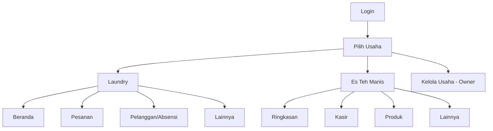

# 3. UI/UX Design Specification

**Status:** spesifikasi dari implementasi aktif, bukan file desain Figma  
**Target utama:** ponsel Android dan printer thermal 58/80 mm

## 1. Prinsip desain

1. **Tugas harian lebih dahulu.** Aksi yang paling sering dipakai tampil sebelum konfigurasi.
2. **Satu konteks usaha.** Nama dan jenis usaha aktif selalu jelas; perpindahan usaha dilakukan secara sadar.
3. **Status harus bermakna.** Gunakan Menunggu, Disetujui, Ditolak, Diproses, Selesai, Belum Bayar, DP, atau Lunas sesuai objeknya.
4. **Ringkas tetapi dapat dibuka.** Daftar menampilkan informasi inti, sedangkan rincian berada di expansion/dropdown, sheet, atau halaman detail.
5. **Aman untuk kasir.** Total, sisa bayar, metode, dan hasil simpan selalu mendapat konfirmasi visual.
6. **Kembali ke asal.** Tombol back mengikuti history halaman, termasuk saat masuk dari notifikasi atau detail.

## 2. Design system

| Token | Nilai |
| --- | --- |
| Font | DM Sans, 400–700 |
| Primary navy | `#071F70` |
| Primary blue | `#0B2E9F` |
| Royal blue | `#123FC4` |
| Gold | `#F5A800` |
| Background | `#FAFAF8` |
| Surface | `#FFFFFF` |
| Main text | `#172033` |
| Secondary text | `#667085` |
| Success | `#15803D` |
| Warning | `#D97706` |
| Error | `#D92D20` |

Pedoman komponen:

- tinggi target sentuh minimum 44–48 dp;
- radius kartu dan input konsisten 12–20 dp;
- satu tombol primer per kelompok aksi;
- nominal rata kanan dan memakai pemisah ribuan;
- chip status memakai warna serta teks, tidak mengandalkan warna saja;
- sheet panjang harus dapat di-scroll dan menghindari keyboard.

## 3. Arsitektur informasi

## 4. Layar utama

### 4.1 Pilih usaha

- Header ringkas dengan profil dan logout.
- Kartu usaha memuat ikon, nama, jenis, serta chip **Aktif**.
- Seluruh kartu dapat disentuh.
- Owner melihat tombol **Kelola Usaha** untuk tambah usaha dan assign karyawan.
- Margin logo dibuat secukupnya agar pilihan usaha muncul tanpa scroll yang tidak perlu.

### 4.2 Buat pesanan laundry

Urutan konten:

1. pelanggan, refresh kontak, dan tambah pelanggan;
2. jenis pesanan: Kiloan, Satuan, Gabung;
3. keranjang layanan;
4. ringkasan total dan sisa;
5. status pembayaran cepat: Belum, DP 50%, Lunas;
6. expansion **Nominal Manual, Metode Bayar & Kasir**;
7. catatan dan tenggat dalam bagian yang dapat dibuka;
8. tombol **Simpan Pesanan**;
9. setelah berhasil, sheet pilihan cetak satu per satu.

Konten yang jarang diubah ditempatkan pada expansion agar total dan tombol simpan tetap mudah dijangkau. Sheet harus memiliki padding bawah sesuai keyboard dan safe area.

### 4.3 Pemilih layanan dan ukuran

- Kategori dan layanan dapat dicari.
- Layanan yang memiliki ukuran tampil sebagai pilihan eksplisit.
- “Sprei Besar 160”, “Sprei Besar 180”, dan “Sprei Besar 200” tampil sebagai pilihan/harga terpisah.
- Keranjang selalu menampilkan nama lengkap varian, unit, jumlah/berat, harga satuan, subtotal, dan hapus.

### 4.4 Cetak dokumen

Setelah pesanan tersimpan, tampilkan tiga aksi mandiri:

| Aksi | Tujuan | Isi utama |
| --- | --- | --- |
| Cetak Nota Pelanggan | Diberikan ke pelanggan/CS | Nomor, tanggal, pelanggan, item, total, dibayar, sisa, metode, status. |
| Cetak Label Cucian | Ditempel ke cucian | Teks besar: nomor, nama, berat/jumlah, layanan, bayar, catatan. |
| Cetak Bukti Pengambilan | Saat lunas/selesai/diambil | Nomor, pelanggan, status lunas atau sisa, tanggal dan penerima. |

Setiap tombol hanya mengirim satu job. Jangan menggabungkan nota dan label dalam satu kertas panjang.

### 4.5 Stok dan pengeluaran

- Bagian atas memuat segmented/tab **Pengadaan** dan **Pengeluaran** bila kedua konteks tetap diperlukan.
- Filter waktu tampil di atas daftar: **Hari ini**, **Kemarin**, **Seminggu**, dan **Lainnya**.
- Baris/kartu ringkas menampilkan nama, nominal/jumlah, kategori, dan tanggal.
- Detail tambahan dibuka melalui expansion/dropdown per baris.
- Tombol aksi menyesuaikan tab: **Tambah Pengadaan Stok** atau **Tambah Pengeluaran**.

### 4.6 Pengajuan karyawan

Kartu daftar memuat:

- jenis dan tanggal/rentang;
- nilai atau ringkasan kebutuhan;
- waktu pengajuan;
- chip keputusan;
- catatan owner dalam blok terpisah jika tersedia.

Istilah status:

| Backend | Label UI |
| --- | --- |
| `pending` | Menunggu keputusan |
| `approved` | Disetujui |
| `rejected` | Ditolak |

Owner memakai tombol **Setujui** dan **Tolak**, bukan “Tandai selesai”. Form pengajuan memakai satu sheet dinamis; field berubah sesuai kategori sehingga stok, izin, kasbon, dan lembur tidak terasa sebagai dua menu yang berbeda.

### 4.7 Pelanggan dan kontak

- Search mencari nama, telepon, atau alamat.
- Aksi sinkron kontak tampil sebagai tombol sekunder yang jelas.
- Aksi **Hapus kontak non-CS** hanya menghapus hasil sinkron di data aplikasi sesuai kriteria nama, bukan kontak sumber pada perangkat/Google.
- Item bawah/navbar memakai tinggi, alignment ikon, label, dan safe area yang konsisten.
- Detail pelanggan menampilkan saldo poin, histori sumber poin, telepon, alamat, dan catatan.

### 4.8 POS minuman

POS sengaja lebih sederhana:

- **Ringkasan:** toggle “Hari ini berjualan”, omzet hari ini, jumlah transaksi, transaksi terbaru.
- **Kasir:** grid/list produk, jumlah di keranjang, total sticky, checkout.
- **Produk:** CRUD untuk owner; karyawan hanya melihat produk aktif.
- **Lainnya:** ganti usaha, profil, dan logout.

Checkout memakai sheet pendek untuk Tunai, Transfer, atau QRIS serta catatan. Setelah berhasil, kembali ke kasir kosong dengan snackbar dan nomor transaksi.

## 5. Responsiveness dan aksesibilitas

- Gunakan `SafeArea`, scrolling, dan batas lebar konten pada tablet.
- Hindari fixed height pada sheet/form yang dapat tertutup keyboard.
- Skala teks tidak boleh memotong total, status, atau tombol primer.
- Ikon tanpa label hanya boleh untuk aksi umum dan tetap memiliki semantic label/tooltip.
- Error ditulis dekat field atau aksi yang gagal; jangan hanya mengandalkan snackbar untuk kesalahan input.
- State kosong menjelaskan aksi berikutnya, misalnya “Belum ada transaksi hari ini”.

## 6. State wajib setiap layar data

| State | Tampilan |
| --- | --- |
| Loading pertama | Skeleton/progress yang tidak menggeser layout secara ekstrem. |
| Refresh | Konten lama tetap terlihat dengan indikator ringan. |
| Empty | Ilustrasi/ikon sederhana, alasan, dan CTA yang sesuai peran. |
| Error | Pesan singkat, detail yang dapat dipahami, tombol Coba Lagi. |
| Offline | Banner koneksi dan larangan menampilkan sukses palsu. |
| Unauthorized | Kembali ke pemilih usaha/route yang valid dengan penjelasan singkat. |

## 7. Checklist review UI

- [ ] Aksi utama terlihat tanpa tertutup navbar atau keyboard.
- [ ] Back kembali ke halaman sebelumnya.
- [ ] Semua nominal/status konsisten antara list, detail, dan cetak.
- [ ] Sheet panjang dapat di-scroll pada layar kecil.
- [ ] Owner dan karyawan hanya melihat aksi yang diizinkan.
- [ ] Teks label 58 mm masih terbaca dan tidak terpotong.
- [ ] Filter Hari ini/Kemarin/Seminggu mempertahankan pilihan saat refresh.
- [ ] POS dapat diselesaikan oleh karyawan baru tanpa membuka menu laundry.

