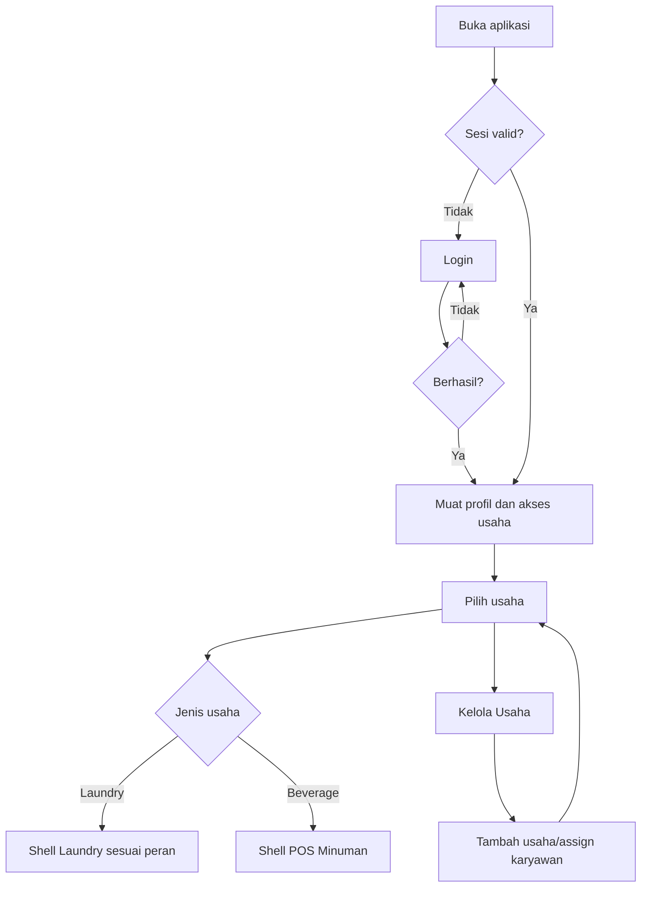
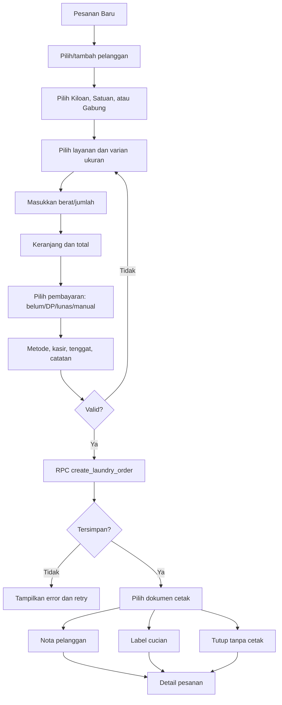
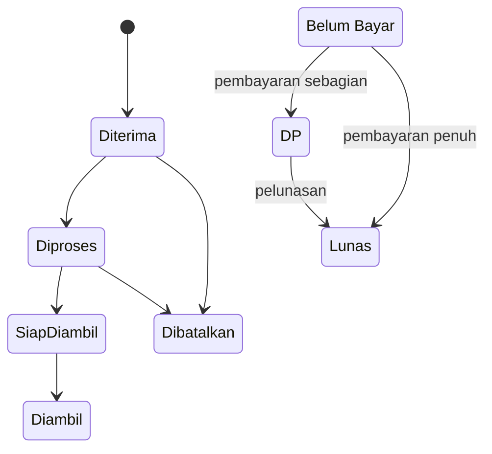
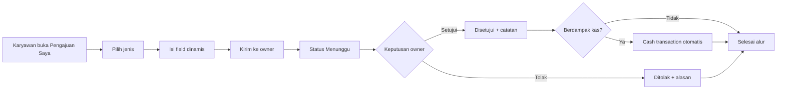
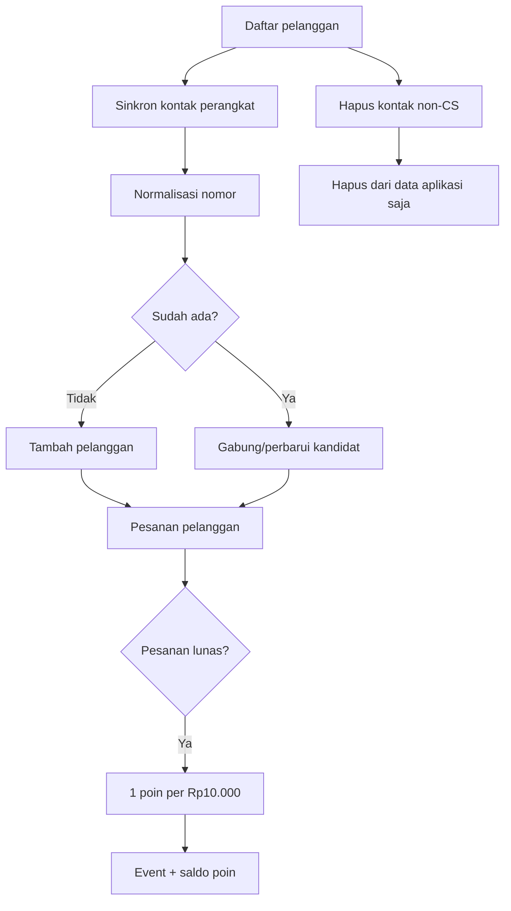
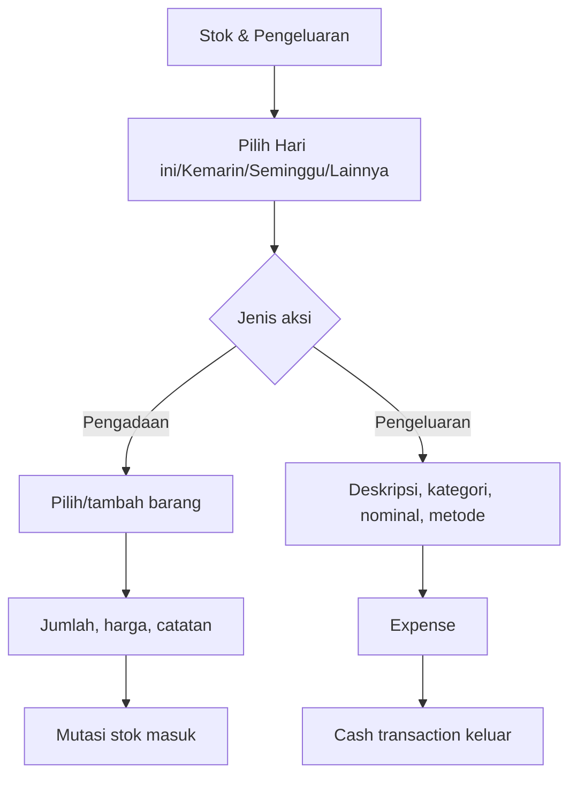
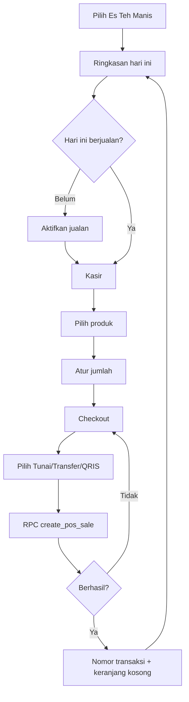
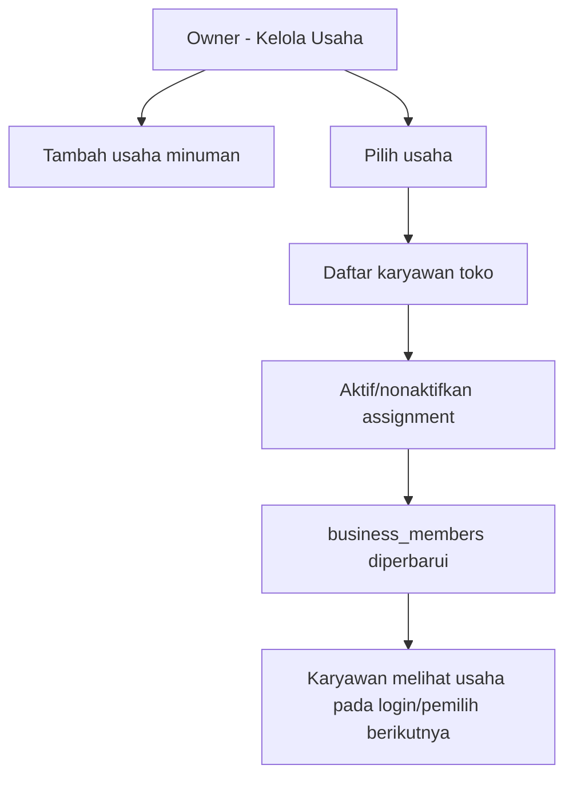
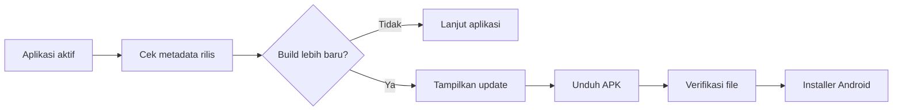

# 4. Application Flow

## 1. Masuk dan memilih usaha

Aturan:

- akun nonaktif tidak boleh melanjutkan;
- usaha nonaktif tidak dapat dipilih untuk transaksi baru;
- owner mengakses usaha milik tokonya;
- karyawan hanya mengakses usaha dengan membership aktif.

## 2. Membuat pesanan laundry

Nota dan label merupakan job yang berbeda. Pengguna dapat kembali ke detail untuk mencetak ulang.

## 3. Proses, pembayaran, dan pengambilan

Status pekerjaan dan pembayaran disimpan terpisah. Saat diambil:

1. kasir memeriksa status dan sisa;
2. pembayaran dapat ditambahkan, atau pengambilan tetap dilanjutkan sesuai kebijakan;
3. penerima dan waktu tersimpan;
4. bukti lunas/pengambilan dapat dicetak terpisah;
5. bila pelanggan bayar nanti, kasir dapat membagikan instruksi transfer/QR melalui WhatsApp dan bukti pengambilan tetap mencerminkan sisa.

## 4. Pengajuan karyawan

Jenis pengajuan aktif: kebutuhan stok, lembur, tukar shift, izin, insentif, dan kasbon.

## 5. Pelanggan, kontak, dan poin

Penghapusan hasil sinkron tidak menghapus kontak asli dari perangkat/akun Google.

## 6. Stok dan pengeluaran

## 7. POS minuman

Jika diperlukan ukuran atau topping sebelum fitur modifier tersedia, owner membuatnya sebagai produk tersendiri.

## 8. Pengelolaan usaha dan karyawan

## 9. Navigasi per peran

| Area | Owner laundry | Karyawan laundry | Anggota POS |
| --- | --- | --- | --- |
| Dashboard/ringkasan | Ya | Ya | Ya, khusus POS |
| Pesanan laundry | Semua | Pesanan saya/operasional | Tidak |
| Pelanggan | Ya | Sesuai UI operasional | Tidak |
| Layanan/stok/pegawai/payroll/laporan | Ya | Tidak | Tidak |
| Absensi/jadwal | Seluruh karyawan | Milik sendiri | Belum menjadi modul khusus POS |
| Review pengajuan | Ya | Tidak | Tidak |
| Buat pengajuan | Tidak | Ya | Mengikuti akun karyawan laundry saat masuk modul laundry |
| Kasir POS | Jika membuka usaha | Jika di-assign | Ya |
| Kelola produk POS | Ya | Baca produk aktif | Baca produk aktif |
| Kelola usaha/assignment | Ya | Tidak | Tidak |

## 10. Update aplikasi

Kegagalan cek update tidak boleh memblokir operasi kecuali rilis secara eksplisit ditandai wajib.

