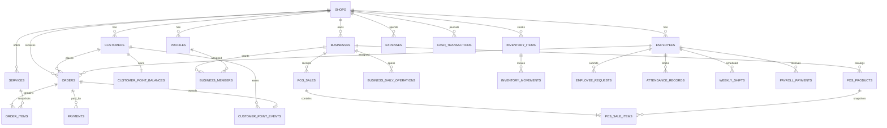

# 5. Backend Schema

**Sumber:** schema Supabase produksi `sqydcdhvsmmkvlpsjzgx` pada 20 September 2026  
**Cakupan:** schema `public` beserta helper pada `private` dan `app_private`

## 1. Ikhtisar

Produksi memiliki **30 tabel public** dan seluruhnya memiliki Row Level Security aktif. Data laundry memakai `shop_id` sebagai batas tenant. Data POS memakai `business_id`, sementara `businesses.shop_id` menghubungkannya ke tenant induk.

## 2. Diagram relasi utama

## 3. Tenant, identitas, dan akses

| Tabel | Fungsi | Kolom penting |
| --- | --- | --- |
| `shops` | Tenant/toko induk | `id`, `name`, `phone`, `address` |
| `profiles` | Profil pengguna Auth | `id`, `shop_id`, `employee_id`, `full_name`, `role`, `is_active`, `username` |
| `employees` | Data kepegawaian | `shop_id`, `name`, `position`, jadwal default, toleransi, gaji, `pin`, `is_active` |
| `businesses` | Unit usaha di bawah toko | `shop_id`, `owner_id`, `name`, `kind`, `status` |
| `business_members` | Assignment profil ke usaha | `business_id`, `profile_id`, `is_active` |

Aturan akses:

- `profiles` mengikat user Auth ke satu shop dan role;
- owner mengakses bisnis yang dimiliki dalam shop;
- karyawan mengakses bisnis melalui membership aktif;
- penghapusan membership mencabut akses pada query berikutnya.

## 4. Laundry dan pelanggan

| Tabel | Fungsi | Kolom penting |
| --- | --- | --- |
| `service_categories` | Kelompok layanan | `shop_id`, `name`, `sort_order`, `is_active` |
| `services` | Harga/varian layanan | kategori, item, ukuran, material, unit, harga, estimasi, express, urutan |
| `customers` | Pelanggan | nama, telepon asli/normalisasi, alamat, catatan, soft delete |
| `orders` | Header order | nomor, customer/employee, snapshot nama/telepon/penerima, status order/bayar, total, paid, note, due |
| `order_items` | Detail order | service id, snapshot nama/kategori/unit/harga, quantity, subtotal |
| `payments` | Pembayaran order | `order_id`, amount, method, note, actor, waktu |

Snapshot pada `orders` dan `order_items` wajib dipertahankan agar nota lama tidak berubah ketika pelanggan, layanan, atau harga diedit.

## 5. Loyalty pelanggan

| Tabel | Kunci | Peran |
| --- | --- | --- |
| `customer_point_events` | `order_id` | Event idempoten per pesanan, menyimpan shop, customer, points, dan waktu update. |
| `customer_point_balances` | `customer_id` | Saldo materialized per pelanggan dan shop. |

Trigger `app_private.sync_customer_points()` menjaga event dan balance ketika status pembayaran order berubah. Formula rilis saat ini adalah satu poin untuk setiap Rp10.000 total order yang lunas.

Rencana penukaran poin memerlukan tabel tambahan seperti `point_redemptions` atau event bertipe debit. Jangan mengubah saldo langsung tanpa ledger.

## 6. POS minuman

| Tabel | Fungsi | Kolom penting |
| --- | --- | --- |
| `pos_products` | Katalog per usaha | `business_id`, name, category, price, active, sort order |
| `pos_sales` | Header transaksi | business, sale number, total, payment method, notes, seller, time |
| `pos_sale_items` | Item transaksi | product id dan snapshot nama, quantity, unit price, subtotal |
| `business_daily_operations` | Status buka harian | business, date, `is_open`, note, updater |

Unique constraint logis diperlukan pada `(business_id, operation_date)` agar satu usaha hanya memiliki satu status per hari. Nomor sale dan pembuatan item dilakukan melalui RPC `create_pos_sale`.

## 7. Karyawan dan operasional

| Tabel | Fungsi |
| --- | --- |
| `attendance_records` | Check-in/out, status terlambat, menit terlambat, foto. |
| `weekly_shifts` | Jadwal per hari dan hari libur. |
| `employee_requests` | Pengajuan, amount, status review, catatan owner, metode pembayaran. |
| `payroll_payments` | Pembayaran gaji per periode. |
| `notifications` | Pesan bertarget profil dengan route dan referensi durable. |

## 8. Stok dan keuangan

| Tabel | Fungsi |
| --- | --- |
| `inventory_items` | Saldo barang, satuan, minimum, harga beli, status aktif. |
| `inventory_movements` | Ledger stok masuk/keluar/penyesuaian. |
| `expenses` | Pengeluaran operasional dari owner/karyawan dan sumber terkait. |
| `cash_transactions` | Jurnal kas terintegrasi dari pembayaran, expense, payroll, dan request. |
| `cashbook_entries` | Entri buku kas eksplisit/legacy yang masih tersedia. |
| `cash_closings` | Rekonsiliasi saldo harian. |

`inventory_movements` dan `cash_transactions` sebaiknya diperlakukan sebagai ledger: koreksi dilakukan melalui entri pembalik atau RPC, bukan edit langsung tanpa audit.

## 9. Konfigurasi dan audit

| Tabel | Fungsi |
| --- | --- |
| `shop_settings` | Key/value JSON per toko. |
| `audit_logs` | Actor, action, entity, ringkasan, old/new JSON. |
| `database_repair_archive` | Arsip baris yang dipindahkan saat repair schema/data. |

## 10. RPC dan trigger aktif

### RPC yang dipanggil client

- `create_laundry_order(p_customer_id, p_assigned_employee_id, p_note, p_due_at, p_paid_amount, p_payment_method, p_items)`
- `record_order_payment(p_order_id, p_amount, p_method)`
- `adjust_inventory_stock(p_item_id, p_quantity, p_type, p_note)`
- `create_pos_sale(p_business_id, p_payment_method, p_notes, p_items)`
- `get_login_employees()`

### Helper keamanan

- `current_shop_id()`
- `current_role()`
- `current_employee_id()`
- `private.can_access_business(p_business_id)`
- `private.is_business_owner(p_business_id)`

### Trigger bisnis/audit

- `sync_order_status_financials()`
- `sync_payment_cash_transaction()`
- `sync_expense_cash_transaction()`
- `sync_payroll_cash_transaction()`
- `sync_employee_request_cash_transaction()`
- `sync_customer_points()`
- `notify_request_workflow()`
- `notify_owner_new_employee_order()`
- `notify_unpaid_order_reminders()`
- `write_audit_log()`
- `touch_updated_at()`

## 11. Ringkasan RLS

- Semua tabel public: RLS aktif.
- Owner mengelola konfigurasi, layanan, stok, pegawai, payroll, dan review pengajuan pada shop sendiri.
- Anggota toko dapat membaca/menulis operasi harian tertentu seperti order dan expense sesuai policy.
- Karyawan membaca absensi dan pengajuan sendiri; owner membaca data satu toko.
- POS memakai business membership untuk select/insert; perubahan katalog dibatasi owner.
- Tabel poin hanya dapat dibaca staff shop; perubahan berasal dari trigger, bukan insert client umum.
- Storage absensi memakai policy upload/read/delete berdasarkan keanggotaan toko.

Review setiap migrasi harus mencakup **GRANT dan RLS bersama-sama**. RLS membatasi baris, sedangkan grant menentukan apakah role dapat mencapai tabel/fungsi melalui Data API.

## 12. Indeks minimum

Indeks harus tersedia atau diverifikasi pada:

- seluruh foreign key yang dipakai join/filter;
- `orders(shop_id, created_at)`, `orders(shop_id, order_status)`, dan nomor order;
- `customers(shop_id, normalized_phone)`;
- `notifications(target_profile_id, is_read, created_at)`;
- `business_members(profile_id, is_active)` dan `(business_id, profile_id)`;
- `pos_sales(business_id, created_at)`;
- `pos_products(business_id, is_active, sort_order)`;
- `customer_point_events(customer_id)` dan `customer_point_balances(shop_id)`;
- ledger berdasarkan `shop_id` serta `created_at`.

## 13. Aturan migrasi

1. Tambah file migrasi timestamp; jangan mengedit migrasi yang sudah diterapkan.
2. Gunakan constraint dan check untuk enum teks/status penting.
3. Aktifkan RLS sebelum tabel dianggap siap.
4. Beri grant minimum untuk role yang memerlukan.
5. Untuk `SECURITY DEFINER`, set `search_path` tetap dan revoke execute publik bila tidak diperlukan.
6. Tambah index untuk foreign key serta kolom policy/filter.
7. Uji owner, employee, anggota bisnis, nonanggota, dan user tanpa profil.
8. Verifikasi schema produksi setelah apply.

