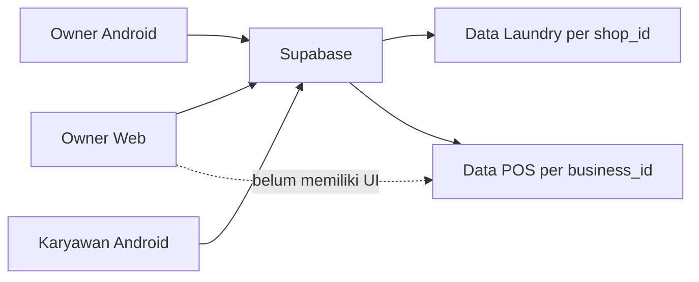

# Blueprint Dashboard Admin Idola One

**Implementasi lokal diperiksa:** 29 September 2026<br>
**Versi source Android:** 2.1.4+20 (`laundry_app_flutter/pubspec.yaml`)<br>
**Backend bersama:** Supabase production `sqydcdhvsmmkvlpsjzgx`<br>
**Status website:** desain dan navigasi baru tersedia di source lokal; belum diterbitkan ke VPS.

## 1. Posisi dashboard dalam produk

Dashboard web adalah alat kerja owner untuk data operasional Laundry. Dashboard memakai Supabase production yang sama dengan Android; tidak memiliki database terpisah. Aplikasi Android telah berkembang menjadi aplikasi multi-usaha dengan Laundry dan POS minuman, sedangkan dashboard web saat ini masih berfokus pada satu `shop_id` dan modul Laundry.



## 2. Prinsip sistem

- Supabase adalah sumber kebenaran bersama.
- Data Laundry diisolasi dengan `shop_id`; data POS diisolasi dengan `business_id` dan membership.
- Browser hanya memakai publishable/anon key serta JWT pengguna; `service_role` tidak boleh masuk ke bundle Vite.
- RLS tetap memeriksa akses walaupun menu disembunyikan di UI.
- Realtime hanya memicu query ulang. Payload event tidak dipakai sebagai saldo/status final.
- Operasi finansial dan operasi atomik memakai RPC/trigger yang sama dengan Android.
- Snapshot nama pelanggan, layanan, produk, dan harga harus dipertahankan untuk histori.

## 3. Implementasi dashboard web lokal saat ini

Source dashboard masih terpusat pada `admin_dashboard_web/src/App.tsx` dengan React, TypeScript, Vite, Supabase JS, dan Lucide. Desain terbaru memakai sidebar biru pada desktop, menu geser pada ponsel, kartu KPI, dan tabel pesanan. Beranda dibuat ringkas; modul lain dibuka dari menu kiri. Preview data contoh hanya aktif saat Vite berjalan dalam mode development dengan `?preview=1`.

Menu kiri saat ini: **Beranda, Pesanan, Analitik, Pengajuan, Stok, Pelanggan, Tim, Laporan, Pengaturan**. Kartu KPI di Beranda membuka modul terkait. Pencarian dari Beranda atau modul non-data membawa pengguna ke Pesanan; di Pelanggan dan Tim pencarian bekerja pada data modul tersebut.

| Area | Kemampuan aktual | Status |
| --- | --- | --- |
| Login | Email/username, hanya profil owner aktif | Selesai |
| Beranda | Enam KPI: pesanan hari ini, pesanan baru, pelanggan, karyawan aktif, pemasukan bulan ini, stok menipis; pengajuan pending dan tujuh pesanan terbaru | Selesai sebagai ringkasan lokal; angka pesanan/kas masih mengikuti hasil query terbatas |
| Analitik | Grafik pesanan masuk dan selesai untuk minggu kalender Senin–Minggu atau bulan kalender penuh yang dipilih, posisi pesanan, sisa tagihan | Selesai untuk data yang termuat; histori progres belum berbasis log transisi |
| Pengajuan | Filter status, setujui, tolak, bayar, selesaikan, catatan owner | Sebagian; istilah/status web perlu disamakan dengan Android |
| Pesanan | Cari, filter status, tabel 10 baris per halaman, ubah status, catat pembayaran | Sebagian; pagination masih di browser, belum ada detail item lengkap/cetak |
| Pelanggan | Cari, tambah, ubah, soft delete, 12 baris per halaman, jumlah total dari count terpisah | Sebagian; daftar dibatasi query dan belum ada poin/pagination server |
| Inventaris | Item, stok minimum, tambah item, adjustment, riwayat mutasi | Selesai untuk kebutuhan dasar |
| Karyawan | Tambah akun melalui Edge Function, ubah profil, aktif/nonaktif | Selesai untuk Laundry |
| Shift | CRUD jadwal mingguan dan hari libur | Selesai |
| Laporan | Pemasukan, pengeluaran, saldo bulan berjalan; kas manual, ekspor CSV, 12 transaksi per halaman, 15 audit log terbaru | Sebagian; pagination masih di browser dan belum ada agregat periode server |
| Pengaturan | Nama, telepon, dan alamat toko | Selesai |
| Realtime | Request, order, employee, customer, inventory, shift, movement, cash, audit; refresh fokus dan polling 15 detik | Diimplementasikan; uji lintas perangkat pada versi lokal baru belum dilakukan |
| Multi-usaha | Belum ada pemilih/kelola usaha atau assignment | Belum |
| POS minuman | Belum ada produk, transaksi, status buka, laporan, dan kas | Belum |
| Poin pelanggan | Belum menampilkan saldo/event | Belum |

## 4. Matriks Android, web, dan backend

| Modul | Android | Dashboard web | Sumber utama |
| --- | --- | --- | --- |
| Auth/profil | Owner dan karyawan | Owner | Auth, `profiles`, `employees` |
| Pemilih usaha | Ya | Belum | `businesses`, `business_members` |
| Pesanan Laundry | Buat, detail, status, pembayaran, cetak | List, status, pembayaran | `orders`, `order_items`, `payments` dan RPC |
| Layanan/harga | CRUD owner, pemilih varian | Belum | `service_categories`, `services` |
| Pelanggan/kontak | CRUD, sinkron/reset/filter kontak | CRUD dasar | `customers` |
| Poin pelanggan | Saldo realtime | Belum | `customer_point_events`, `customer_point_balances` |
| Printer | Nota, label, bukti pengambilan terpisah | Belum | Device Bluetooth, data order |
| Stok | Item dan mutasi | Item dan mutasi | `inventory_items`, `inventory_movements` |
| Pengeluaran/kas | Riwayat dan filter periode | Kas manual/dasar | `expenses`, `cash_transactions` |
| Karyawan/shift | Lengkap sesuai role | CRUD owner | `employees`, `profiles`, `weekly_shifts` |
| Absensi | Check-in/out dan foto | Belum | `attendance_records`, Storage |
| Pengajuan | Buat/pantau/review | Review dasar | `employee_requests` |
| Payroll | Bayar dan histori | Belum | `payroll_payments`, cash trigger |
| Notifikasi | Inbox/badge/deep link | Belum | `notifications` |
| POS minuman | Produk, kasir, sale, status buka | Belum | `pos_*`, `business_daily_operations` |
| Audit | Tidak menjadi layar utama | 15 aktivitas terbaru | `audit_logs` |
| Update Android | Cek dan instal APK | Tidak relevan | Storage `app-releases` |

### Definisi angka dan periode pada tampilan lokal

- **Pesanan hari ini** menghitung `orders.created_at` menurut tanggal perangkat browser.
- **Pesanan baru** menghitung seluruh order yang termuat dengan `order_status = received`.
- **Pelanggan** menggunakan count aktif dari query terpisah, bukan panjang daftar pelanggan yang dimuat.
- **Pemasukan, pengeluaran, dan saldo bulan ini** memakai transaksi kas yang termuat sejak tanggal 1 bulan berjalan.
- **Minggu ini** berarti Senin–Minggu kalender; **Per bulan** berarti tanggal 1 sampai hari terakhir bulan pilihan, misalnya 1–31 Agustus, bukan 30 hari berjalan.
- Grafik **Masuk** mengelompokkan `orders.created_at`. Grafik **Selesai** mengelompokkan `orders.updated_at` dari order yang statusnya saat ini `ready` atau `picked_up`. Ini belum merupakan histori kejadian selesai yang presisi apabila order berubah lagi setelah selesai.
- Sisa tagihan dihitung dari `total_price - paid_amount` pada order belum lunas yang termuat.
- Query order dan kas mengambil data sejak 1 Januari tahun sebelumnya, masing-masing meminta maksimal 5.000 baris; query pelanggan meminta maksimal 5.000 baris. Batas maksimal baris pada API Supabase dapat membuat hasil aktual lebih kecil. Pagination pada UI hanya memecah data yang sudah diterima browser.

## 5. Kontrak realtime produksi

Tabel dalam publication `supabase_realtime` per 25 September 2026:

`attendance_records`, `audit_logs`, `cash_closings`, `cash_transactions`, `customer_point_balances`, `customers`, `employee_requests`, `employees`, `expenses`, `inventory_items`, `inventory_movements`, `notifications`, `order_items`, `orders`, `payments`, `payroll_payments`, `profiles`, `services`, dan `weekly_shifts`.

`businesses`, `business_members`, `pos_products`, `pos_sales`, `pos_sale_items`, dan `business_daily_operations` belum berada dalam publication. Android POS saat ini memuat ulang data melalui controller/query setelah aksi; jika dashboard POS ditambahkan, gunakan publication dengan RLS/filter yang benar atau polling/focus refresh yang terdokumentasi.

Pola halaman realtime:

1. query snapshot awal dengan filter tenant;
2. subscribe hanya ke tabel relevan;
3. query ulang ketika event diterima;
4. refresh saat tab kembali fokus;
5. rekonsiliasi berkala ketika halaman terlihat;
6. pertahankan data lama dan tampilkan gangguan sinkronisasi saat refresh gagal;
7. mutation harus mengembalikan row/RPC result dan tidak boleh menampilkan sukses jika nol row berubah.

## 6. Aturan bisnis yang harus sama

### Pesanan dan pembayaran

- Status order: `received`, `processing`, `ready`, `picked_up`, `cancelled`.
- Status pembayaran: `unpaid`, `partial`, `paid`.
- Pesanan boleh menjadi `picked_up` walaupun belum lunas sesuai migration `20260913034252_allow_unpaid_order_pickup.sql`; sisa harus tetap terlihat dan dapat ditagih kemudian.
- Pembayaran tambahan wajib memakai `record_order_payment`.
- Total order mengikuti pembulatan backend dan tidak dihitung berbeda di web.
- Sprei 160, 180, dan 200 adalah layanan/harga terpisah.

### Pengajuan

Status storage: `pending`, `approved`, `rejected`, `paid`, `completed`.

Android menampilkan `completed` non-uang sebagai **Disetujui** agar owner tidak terlihat sekadar “menandai selesai”. Dashboard masih memiliki tombol **Selesaikan** untuk request non-uang; ini merupakan gap UI yang perlu diperbaiki menjadi istilah keputusan/penyelesaian yang jelas.

### Poin pelanggan

- Satu event per order melalui `app_private.sync_customer_points()`.
- Poin diberikan ketika pesanan berpelanggan menjadi lunas.
- Formula aktif: `floor(total_price / 10.000)`.
- Dashboard hanya membaca saldo/event; perubahan tidak dilakukan dengan edit balance langsung.

### POS minuman

- Akses berdasarkan owner atau `business_members` aktif.
- Sale dan item harus dibuat melalui `create_pos_sale`.
- Nama dan harga produk disalin ke item sale.
- Status buka harian unik per business dan tanggal.

## 7. Gap dan prioritas dashboard

### P0 — integritas dan konsistensi

- Gunakan `.select()` atau RPC result pada seluruh update/delete agar nol-row akibat RLS dianggap gagal.
- Ganti metrik order dan kas yang masih berbasis hasil query terbatas dengan aggregate/RPC server. Count pelanggan sudah memakai query count terpisah.
- Samakan label pengajuan dengan Android dan hilangkan tombol “Selesaikan” yang ambigu.
- Pastikan transisi `picked_up` belum lunas ditampilkan dengan sisa bayar, bukan ditolak oleh validasi web lama.
- Ganti pagination lokal dengan pagination/filter server untuk order, customer, kas, dan audit.
- Simpan histori transisi order agar grafik selesai merepresentasikan tanggal kejadian, bukan `updated_at` terakhir.

### P1 — parity Laundry

- Detail order lengkap: item, penerima, petugas, tenggat, note, pembayaran, poin, dan cetak/export.
- Master layanan/harga dengan ukuran dan varian.
- Pengeluaran terstruktur dari `expenses`.
- Absensi/foto, payroll, notifikasi, dan laporan periode.
- Saldo serta histori poin pada detail pelanggan.

### P1 — multi-usaha dan POS owner

- Pemilih usaha setelah login.
- CRUD usaha dan assignment karyawan.
- Ringkasan POS: buka hari ini, omzet, jumlah transaksi.
- Produk POS dan histori sale/item.
- Laporan per `business_id`; jangan mencampurkan omzet POS dengan Laundry.

### P2 — operasional dan skala

- Tutup kas POS, void/refund dengan audit, dan pengeluaran per usaha setelah backend tersedia.
- Monitoring sync dan health tanpa credential.
- Backup/export owner dengan kontrol akses.
- Pemecahan `App.tsx` menjadi module feature-first.

## 8. Struktur halaman dan target kode dashboard

Alur saat ini: **Beranda → menu modul di sidebar → tabel/filter → tindakan**. Pada layar kecil, sidebar dibuka lewat tombol menu. Beranda hanya memuat ringkasan dan pesanan terbaru; grafik berada di Analitik, pengajuan di Pengajuan, dan mutasi stok di Stok. Daftar panjang di Pesanan, Pelanggan, serta kas Laporan memiliki pagination lokal. Tombol perubahan data tetap memanggil operasi Supabase yang sudah ada.

Struktur kode jangka panjang:

```text
src/
├── app/                 # auth gate, layout, router, active business
├── features/
│   ├── dashboard/
│   ├── businesses/
│   ├── laundry-orders/
│   ├── customers/
│   ├── services/
│   ├── finance/
│   ├── inventory/
│   ├── team/
│   ├── attendance/
│   ├── requests/
│   └── pos/
├── lib/supabase/        # query, mutation, subscription, mapper
└── shared/              # status labels, formatter, UI components
```

## 9. Definition of done

Dashboard dianggap sinkron dengan project saat ini bila:

- P0 selesai dan semua mutation mendeteksi nol-row;
- metrik tidak bergantung pada batas 50 baris;
- order belum lunas dapat diambil dengan sisa yang tetap konsisten;
- perubahan web muncul di Android dan sebaliknya melalui realtime/recovery;
- multi-usaha menggunakan `business_id` dan membership, bukan hanya `shop_id`;
- laporan Laundry dan POS dapat dipisahkan;
- owner dapat melihat poin tanpa dapat memalsukan saldo;
- RLS lintas shop/business diuji;
- lint, build, dan smoke test browser lulus.

## 10. Validasi dan penerbitan

- Pada 29 September 2026, perubahan lokal `admin_dashboard_web/src/App.tsx` dan `App.css` lulus lint serta production build. Tampilan desktop dan ponsel, sembilan menu, pencarian, dan contoh Agustus 31 hari diperiksa di preview lokal.
- Preview `?preview=1` memakai data contoh dan tidak memverifikasi sinkronisasi produksi. Login biasa tetap membaca Supabase sesuai konfigurasi lokal.
- Website baru **belum** di-push atau diterbitkan. VPS lama tidak sedang dipakai; setelah VPS pengganti tersedia, perbarui host, SSH key/known_hosts, webroot, dan health check pada workflow deployment sebelum menerbitkan build.

## 11. Peralihan dari buku manual per 1 Oktober 2026

Panduan operasional terperinci ada di [Panduan pindah dari buku manual ke aplikasi](09-GO-LIVE-BUKU-MANUAL-KE-APLIKASI.md). Blueprint ini menetapkan batas teknis agar angka dashboard tidak keliru dibaca pada hari pertama:

| Jenis angka | Aturan peralihan |
| --- | --- |
| Pesanan hari ini | Hanya pesanan baru sejak jam mulai yang ditetapkan owner. Nota buku lama yang diinput melalui form biasa akan terlihat sebagai pesanan baru hari input. |
| Pemasukan dan saldo | Pembayaran lama/DP sebelum jam mulai bukan penerimaan baru. Buku Kas berasal dari `cash_transactions`; saat ini belum ada alur UI yang terbukti untuk migrasi saldo awal per metode. |
| Piutang | Pisahkan piutang nota lama dari sisa tagihan pesanan baru sampai tersedia importer yang menjaga pembayaran dan tanggal asli. |
| Pelanggan | Impor akun Google terpilih dan cek duplikat; reset hasil sinkron tidak sama dengan reset seluruh data toko. |
| Stok | Isi stok fisik awal sebagai stok awal item. Mutasi masuk/keluar setelah titik potong saja dihitung sebagai pergerakan baru. |
| Grafik bulan | Per bulan berarti bulan kalender penuh. Jika data historis buku belum dimigrasikan, grafik Oktober hanya menggambarkan data aplikasi sejak titik potong, bukan seluruh histori toko. |

**Kebutuhan produk berikutnya:** importer nota aktif yang idempoten dan dapat diaudit, saldo pembuka kas terpisah per metode, rekonsiliasi piutang lama, serta metrik server untuk dashboard. Sebelum fitur itu selesai, jangan membuat pesanan/pembayaran palsu hanya agar angka dashboard sama dengan buku manual.
